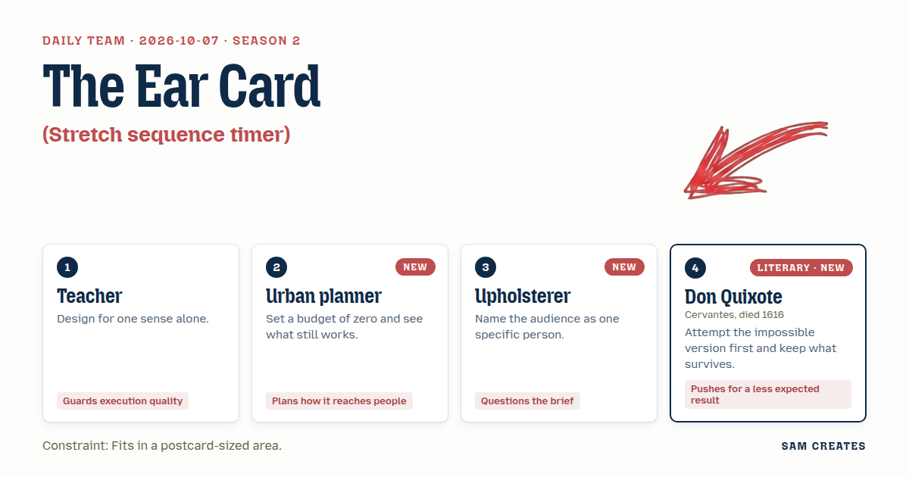
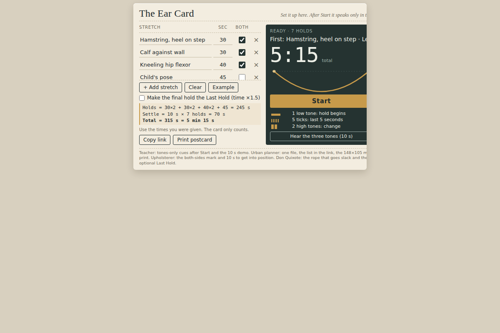

# 2026-10-07: The Ear Card

[Today](../../README.md) · [Archive](../../ARCHIVE.md)



**Task:** Stretch sequence timer: the user lists stretches and hold times, and the timer runs through them.

**Constraint:** Fits in a postcard-sized area.

**Season:** 2026-10-05

**Decision:** The page is a 560×400 px card where the user lists stretches, hold times, and a "both sides" mark, then runs the sequence by ear through three tone patterns and vibration, with a shareable link carrying the list.

## Asset

<a href="artifact-1.html"></a>

[Use it](https://isas1.github.io/daily-team/2026-10-07/) · [artifact-1.html](artifact-1.html), led by Teacher. Model: claude-opus-5-5.

## The session

### Pitch

**1 · Teacher: The Ear Card**\
Nobody reads a screen with their forehead on their knee.\
So after Start, the page speaks only in sound.\
One low tone: hold begins. Five soft ticks: last five seconds. Two high tones: change.\
The card is where you set it up. Then it never asks to be looked at again.\
Three patterns, taught in a ten-second demo before the first stretch.\
If the student needs her eyes, I failed the lesson.

**2 · Urban planner: Free Postcard**\
Budget zero. No server, no account, no web fonts, no audio files.\
One HTML file. Tones made in the browser. The list lives after the # in the address.\
A physio types the sequence once and texts the link. The patient taps it on any phone.\
Muted phone? The big number still counts down.\
Print it and it's a postcard on the fridge with the list written on it.\
What survives zero is what reaches people.

**3 · Upholsterer: For Dolores's Knees**\
Dolores. Fifty-eight. Sews car seats in a shop with a compressor. Kneels most of the day.\
Her physio list is a folded sheet with coffee on it.\
The brief says hold times. Holds aren't her problem. Getting down is. Switching sides is.\
A hamstring stretch is two stretches, left and right. Mark it "both sides" and the card doubles it.\
Give her ten uncounted seconds to get into position, like tacking the corners before you pull the cover tight.\
Short lines on the card. The way I write measurements under a chair frame.

**4 · Don Quixote: The Drawn Rope**\
First I would make the card feel your sinew and hold exactly as long as you can bear. It cannot, so that falls.\
What survives: a line drawn across the card, left to right, taut as a bowstring while you hold.\
When the hold ends, the line goes slack and drops to the bottom edge.\
And one hold in the sequence may be named the Last Hold, longer than the rest, in larger letters.\
A body should have one thing on the list it must ride out to reach.\
Let the rest be ordinary. Not that one.

### Clash

**3 · Upholsterer:** Teacher, Dolores stretches next to the compressor on her break. A soft tone dies under that noise.

**1 · Teacher:** Upholsterer, then the tone is wrong, not the sense. 220 Hz carries under machine hum, and phones that allow it buzz on each change. Her eyes stay out of it.

**2 · Urban planner:** Teacher, your spoken names cost a voice I can't ship. Every phone's speech engine differs, and one will read "Calf L" as "calf fifty."

**1 · Teacher:** Urban planner, agreed. Speech goes. Tones only, three patterns. It fails quietly instead of saying something wrong.

**4 · Don Quixote:** Teacher, you would blind the card. From the floor a slack rope says "done" faster than any chime.

**1 · Teacher:** Don Quixote, from the floor she sees the ceiling. Keep the rope for setup and for anyone standing. It doesn't carry the meaning.

**3 · Upholsterer:** Don Quixote, the Last Hold is a dare. Dolores will chase it and tear something. Her hold times come from her physio.

**4 · Don Quixote:** Upholsterer, a list with nothing to reach for is a list of chores, and chores get skipped by Thursday.

**2 · Urban planner:** Upholsterer, her physio won't write a hash. So the card writes it: fill the boxes, press Copy link, paste it into a text.

**3 · Upholsterer:** Don Quixote, put it behind a checkbox and I still say no. You don't stretch fabric past the frame because it looks brave.

### Decision

The page is a 560×400 px card where the user lists stretches, hold times, and a "both sides" mark, then runs the sequence by ear through three tone patterns and vibration, with a shareable link carrying the list.

Concept: The Ear Card

- Teacher: tones-only cueing after Start (one 220 Hz tone to begin, five ticks to end, two high tones to change), plus the ten-second demo.
- Urban planner: single file, Web Audio tones, list stored in the URL hash, Copy link button, print layout at 148×105 mm.
- Upholsterer: "both sides" checkbox that doubles a line into Left and Right, and a 10-second uncounted get-into-position gap before each hold.
- Don Quixote: the drawn line across the card that goes slack at each hold's end, and an optional Last Hold, off by default and capped at 1.5 times the listed time.
- Don Quixote lost the rope as the main signal because a person face-down can't see it. Upholsterer lost the fight to cut the Last Hold, because the cap and the default-off setting keep it inside the physio's numbers.

### Build notes

1. Make the card a fixed 560×400 px box. Use an editor of rows (name, seconds, both-sides checkbox), then Start, Demo tones, and Copy link. Encode rows as `#name~seconds~b|...` and read the hash on load.
2. Build the three cues with one OscillatorNode each: a 220 Hz sine for 600 ms to start a hold, 880 Hz ticks of 80 ms for the last 5 seconds, and two 660 Hz beeps of 150 ms to change. Call `navigator.vibrate(200)` on every change where the browser supports it. Insert a silent 10-second gap before each hold.
3. Draw the rope as an SVG path that stays straight during a hold and animates to a sagging curve over 400 ms when the hold ends. Add an `@media print` rule that hides the controls and prints the list at 148×105 mm.

**Guest:** Don Quixote (literary; Cervantes, died 1616). The method is drawn from public-domain history, myth, or literature, or invented. The guest speaks in character in original words, never quoting the source, and nothing here is endorsed by anyone.

## Team

```text
Team for 2026-10-07
Season: 2026-10-05

1. Teacher
   Method: Design for one sense alone.
   Stance: Guards execution quality.
2. Urban planner
   Method: Set a budget of zero and see what still works. [new]
   Stance: Plans how it reaches people.
3. Upholsterer [new]
   Method: Name the audience as one specific person.
   Stance: Questions the brief.
4. Don Quixote (literary; Cervantes, died 1616) [guest] [new]
   Method: Attempt the impossible version first and keep what survives.
   Stance: Pushes for a less expected result.

Constraint: Fits in a postcard-sized area.
Task: Stretch sequence timer: the user lists stretches and hold times, and the timer runs through them.
```

Provider: claude. Model: claude-opus-5-5.
