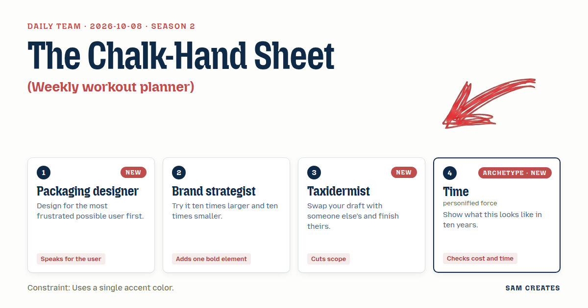
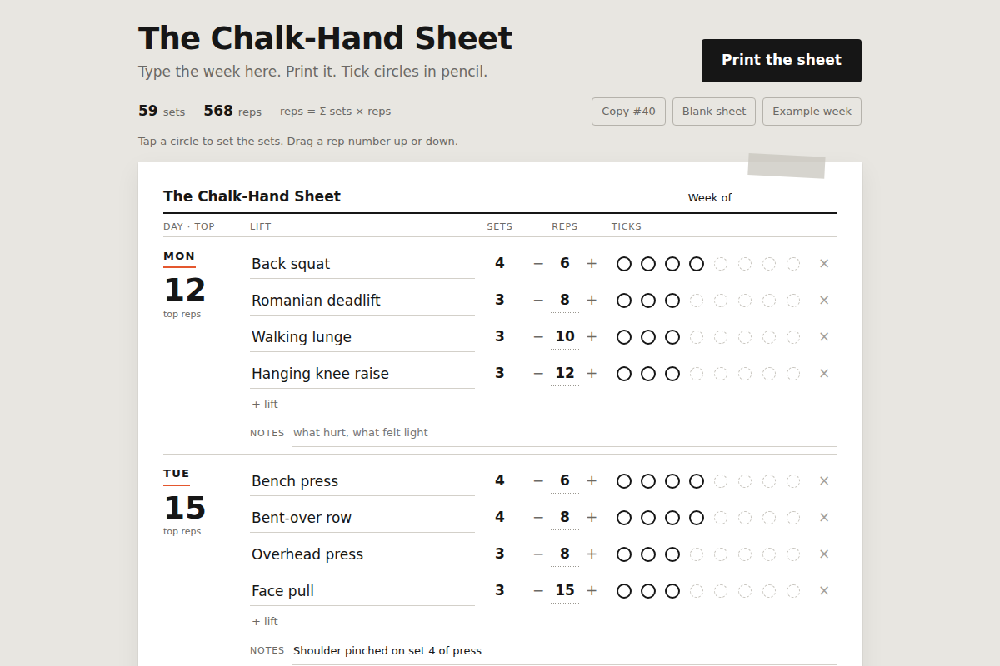

# 2026-10-08: The Chalk-Hand Sheet

[Today](../../README.md) · [Archive](../../ARCHIVE.md)



**Task:** Weekly workout planner: days, exercises, sets, and reps, printable.

**Constraint:** Uses a single accent color.

**Season:** 2026-10-05

**Decision:** The page is a one-sheet weekly planner: the user types days, exercises, sets, and reps on screen, then prints a black-and-white A4 grid with one empty circle per set and one thin orange rule under each day name.

## Asset

<a href="artifact-1.html"></a>

[Use it](https://isas1.github.io/daily-team/2026-10-08/) · [artifact-1.html](artifact-1.html), led by Packaging designer. Model: claude-opus-5-5.

## The session

### Pitch

**1 · Packaging designer: The Chalk-Hand Sheet**\
Picture her at 6 a.m. Chalk on her fingers, phone in the locker, a pencil with a chewed end.\
She can't scroll, so everything sits on one A4 sheet. Seven day rows, and every write-in box is 9 mm tall so a shaking hand still fits.\
Sets are empty circles, one per set. She fills a circle when the set is done. No arithmetic between sets.\
On screen she types the plan. On paper she only ticks.\
The accent goes on the one thing she must never miss.

**2 · Brand strategist: The One Number**\
I tried it ten times larger: seven sheets taped across a garage wall. Ten times smaller: a card the size of a gym tag.\
Both versions taught me the same thing. People remember one number. Twelve reps, not the table around it.\
So each day gets a single numeral, huge, in the accent. That's the day's heaviest target.\
Everything else is grey and quiet underneath it.\
It goes on the fridge because it looks like it belongs there.

**3 · Taxidermist: The Mount**\
I took the designer's draft and finished it. Finishing means taking out what will rot.\
A skin holds its shape on wire and very little else. Seven days, exercise, sets, reps. That's the wire.\
Warm-up row, RPE field, tempo column: gone. They look like muscle but they're stuffing.\
No exercise picker. No template library. A text field takes any word the user knows.\
If it can't stand on four columns, it was never going to stand.

**4 · Time: Week 520**\
I have watched this sheet before. It yellows on the fridge door. The tape lifts at one corner.\
In ten years she still does squats on Monday. The exercises barely change. The ink does.\
So she prints once and photocopies forty times. Whatever is in color fades first, or never gets copied.\
Each print should cost less than the pencil she ticks with.\
Spend the accent the way you would spend a decade, on one line only.

### Clash

**2 · Brand strategist:** Designer, your sheet is polite. Nobody pins polite to a fridge. Give Monday a numeral the height of a fist.

**1 · Packaging designer:** Strategist, a fist-sized numeral eats the box where she writes what she actually lifted. With chalk on her hands she needs room to write, not a poster.

**3 · Taxidermist:** Designer, I finished your draft. I cut the notes column, the warm-up row, the RPE field. Seven days, four columns, set circles. It stands now.

**1 · Packaging designer:** Put one notes line back, Taxidermist. The person this is for is the one whose shoulder hurt on Thursday and who can't remember why by Monday.

**3 · Taxidermist:** One line per day, then. Not per exercise. Skin stretched over too much frame splits at the seams.

**4 · Time:** Strategist, your numeral in full orange costs a cartridge every few weeks. Count the Mondays in ten years. Put the accent on the ticks.

**2 · Brand strategist:** Time, the ticks go in pencil. Then the accent never touches paper. I want one orange thing that survives the printer.

**4 · Time:** Then a thin rule under each day's name. It costs almost nothing, and it is still there when the paper turns.

**2 · Brand strategist:** I'll take the rule, Taxidermist. But the wallet card stays. Ten times smaller, folded into a gym bag.

**3 · Taxidermist:** A second format is a second animal to mount. Cut it.

### Decision

The page is a one-sheet weekly planner: the user types days, exercises, sets, and reps on screen, then prints a black-and-white A4 grid with one empty circle per set and one thin orange rule under each day name.

Concept: The Chalk-Hand Sheet

- Packaging designer: 9 mm write-in boxes, one fillable circle per set, typed plan on screen and pencil ticks on paper.
- Brand strategist: the single orange rule under each day name, set at 2 px in #E4572E. The day's top rep target prints in 28 pt black in the row's left margin.
- Taxidermist: four columns only (exercise, sets, reps, done), no picker, no templates, one notes line per day.
- Time: print-first layout with no filled color areas, so the sheet photocopies cleanly for 40 weeks from one print.
- The strategist lost the giant orange numeral, because the 28 pt black version leaves the write-in boxes their room and costs no colored ink. The strategist also lost the wallet card, because one format fits on one page and a folded A4 already fits a gym bag.

### Build notes

1. Define `--accent: #E4572E` once in CSS. Apply it only to `.day-rule { border-bottom: 2px solid var(--accent); }`. Check with a search of the file that no other selector uses it.
2. Bind each row's sets input (1 to 8) to a script that renders that many 14 px empty circles in the done column. On screen, update the circles on each input event. Under `@media print`, render them with a 1 px black border and no fill.
3. Add `@page { size: A4 portrait; margin: 12mm; }`. Hide the input chrome and the Print button in print. Lay out seven day blocks of up to 5 exercise rows plus one 9 mm notes line each, and confirm the whole week fits on a single sheet with no page break.

**Guest:** Time (archetype; personified force). The method is drawn from public-domain history, myth, or literature, or invented. The guest speaks in character in original words, never quoting the source, and nothing here is endorsed by anyone.

## Team

```text
Team for 2026-10-08
Season: 2026-10-05

1. Packaging designer
   Method: Design for the most frustrated possible user first. [new]
   Stance: Speaks for the user.
2. Brand strategist
   Method: Try it ten times larger and ten times smaller.
   Stance: Adds one bold element.
3. Taxidermist [new]
   Method: Swap your draft with someone else's and finish theirs. [new]
   Stance: Cuts scope.
4. Time (archetype; personified force) [guest] [new]
   Method: Show what this looks like in ten years.
   Stance: Checks cost and time.

Constraint: Uses a single accent color.
Task: Weekly workout planner: days, exercises, sets, and reps, printable.
```

Provider: claude. Model: claude-opus-5-5.
