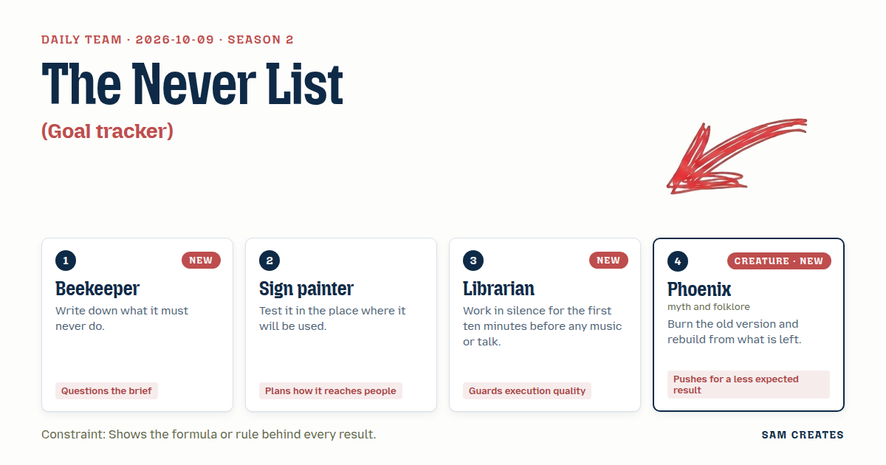
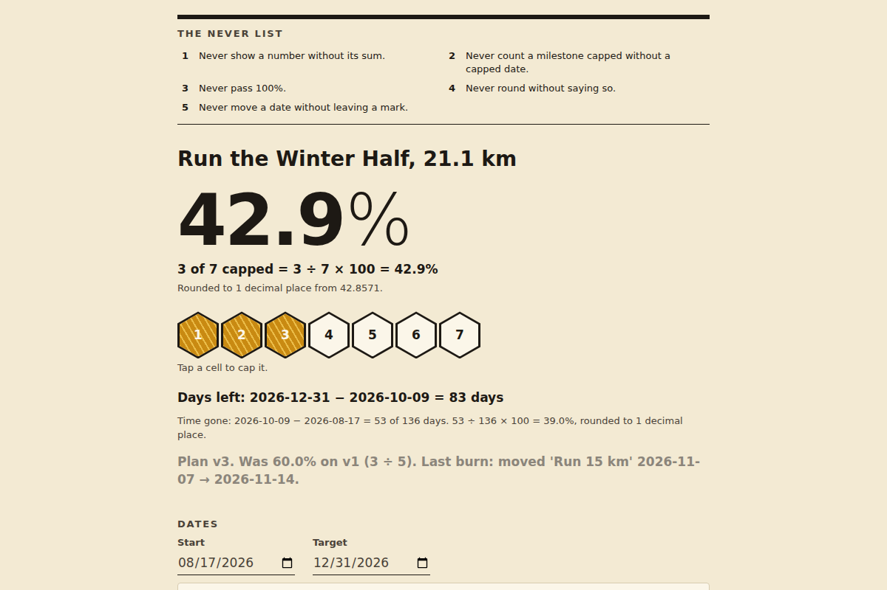

# 2026-10-09: The Never List

[Today](../../README.md) · [Archive](../../ARCHIVE.md)



**Task:** Goal tracker: one goal with milestones, dates, and percent done.

**Constraint:** Shows the formula or rule behind every result.

**Season:** 2026-10-05

**Decision:** The page tracks one goal through dated milestones, shows percent done as a plain count with its formula printed under the number, and keeps every earlier plan as a greyed, folded version whenever a date or milestone changes.

## Asset

<a href="artifact-1.html"></a>

[Use it](https://isas1.github.io/daily-team/2026-10-09/) · [artifact-1.html](artifact-1.html), led by Beekeeper. Model: claude-opus-5-5.

## The session

### Pitch

**1 · Beekeeper: The Never List**\
Before the comb, the rules. Percent done of what, though? The count of milestones, or the work inside them?\
A frame is capped or it isn't. I don't count half-capped frames as half honey.\
So the never list sits at the top of the page in five lines. Never show a number without its sum. Never count a milestone done if it has no done date. Never pass 100. Never round without saying so. Never move a date without leaving a mark.\
Percent = done milestones ÷ all milestones × 100. It's printed under the number every time.

**2 · Sign painter: Read It From the Door**\
Where does this get looked at? On a phone, in a hallway, for half a second between other things.\
So the percent goes big. 96px, black on cream, readable at arm's length and further.\
Under it goes the rule in one line: 3 of 7 done = 42.9%. Same weight as a price on a shop board.\
Days left is shown the same way: 2026-12-31 minus 2026-10-09 = 83 days.\
And it prints. One A4 sheet, taped up. If it fails on a fridge door, it fails.

**3 · Librarian: The Card Catalogue**\
Ten quiet minutes first. Then each milestone becomes a card with a title, due date, done date, and weight.\
Dates are ISO, 2026-11-14, so they sort right and nobody reads 11/04 two ways.\
Every computed figure gets a footnote mark. Open it and the working shows: which cards, which sum, which division.\
State saves to localStorage. Tab order follows the cards. Checkboxes are real checkboxes.\
No value appears on the page unless it can cite its source.

**4 · Phoenix: Ash Layer**\
Plans go wrong. Dates slip. Most trackers overwrite the old plan and pretend.\
Mine burns. Move a date, and the old plan goes to ash. It is kept, greyed, and laid under the live one.\
Percent is reckoned on what rose from the ash. 3 of 7 now. It was 3 of 5 before the burn.\
The formula shows both fires. Plan v2: 3 ÷ 7 = 42.9%. Plan v1: 3 ÷ 5 = 60.0%.\
You see what you lost, and you build on what is left.

### Clash

**1 · Beekeeper:** Phoenix, adding two milestones dropped you from 60 to 42.9. Fine. But cut two and you jump to 100. That's a rewrite raising the number, and it's on my list.

**4 · Phoenix:** Beekeeper, that is why the ash stays. The cut milestones sit in v1, grey, with v1's formula beside them. No burn goes unseen.

**2 · Sign painter:** Phoenix, from the door I see one number. A stack of grey plans under it is a wall. Who reads layer three on a phone?

**4 · Phoenix:** Sign painter, then one line: "Plan v3. Was 60.0% on v1." The older layers fold shut beneath it.

**3 · Librarian:** Beekeeper, a count-only percent says a two-day task equals a two-month one. Give the cards weights. Percent = sum of done weights ÷ sum of all weights.

**1 · Beekeeper:** Librarian, weights are where people fudge. Someone sets their finished milestone to 10 and the rest to 1. A frame is capped or not capped.

**3 · Librarian:** Then the weights print in the formula. 10 + 1 of 14 = 78.6%. If it's fudged, it's fudged in public.

**2 · Sign painter:** Librarian, footnote marks are too small for a thumb. Put the main formula in plain text under the number, with no tap needed.

**3 · Librarian:** Sign painter, agreed for the main figure. The per-milestone working stays behind the mark.

**1 · Beekeeper:** Librarian, it's still no. Printing a fudge doesn't stop it. Weights stay out.

### Decision

The page tracks one goal through dated milestones, shows percent done as a plain count with its formula printed under the number, and keeps every earlier plan as a greyed, folded version whenever a date or milestone changes.

Concept: The Never List

- Beekeeper: the five-rule never list heads the page, each rule is enforced in code, and percent is count-only: done ÷ total × 100.
- Sign painter: a 96px percent with its formula in plain text below it, days left shown as a subtraction, and an A4 print stylesheet.
- Librarian: ISO dates, cards in tab order, real checkboxes, localStorage, and a footnote mark on each milestone that opens its working.
- Phoenix: every date move or milestone add or remove saves the old plan as a version, and the main view shows one line comparing it to v1.
- Librarian lost on weights, because a weight is a number the user picks to move the result, and printing it in the formula does not stop the move. Librarian has not conceded this.

### Build notes

1. Build the header block: the five never rules as a list, a 96px percent rounded to 1 decimal with the text "rounded to 1 decimal place", and the line `3 of 7 done = 3 ÷ 7 × 100 = 42.9%` directly beneath it. Clamp the result at 100 and block "done" on any milestone without a done date.
2. Build milestone cards with a title, a `<input type="date">` for the due date, a checkbox that requires a done date before it saves, and a footnote button showing that card's part of the sum. Save to localStorage under `goal-tracker-v1`. Show days left as `due − today = N days`.
3. On any date change or milestone add or remove, push a snapshot to a versions array. Render one line, "Plan v3. Was 60.0% on v1 (3 ÷ 5)", with older plans in a greyed `<details>` element. Add `@media print` rules for one A4 page that hide the controls.

**Guest:** Phoenix (creature; myth and folklore). The method is drawn from public-domain history, myth, or literature, or invented. The guest speaks in character in original words, never quoting the source, and nothing here is endorsed by anyone.

## Team

```text
Team for 2026-10-09
Season: 2026-10-05

1. Beekeeper [new]
   Method: Write down what it must never do.
   Stance: Questions the brief.
2. Sign painter
   Method: Test it in the place where it will be used.
   Stance: Plans how it reaches people.
3. Librarian
   Method: Work in silence for the first ten minutes before any music or talk. [new]
   Stance: Guards execution quality.
4. Phoenix (creature; myth and folklore) [guest] [new]
   Method: Burn the old version and rebuild from what is left.
   Stance: Pushes for a less expected result.

Constraint: Shows the formula or rule behind every result.
Task: Goal tracker: one goal with milestones, dates, and percent done.
```

Provider: claude. Model: claude-opus-5-5.
