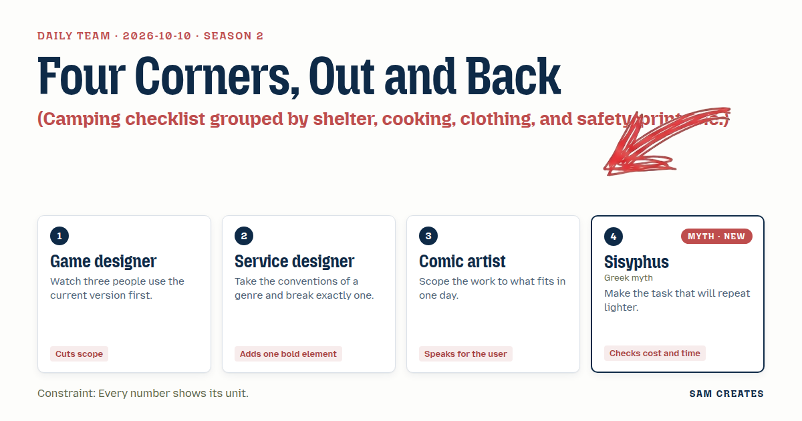
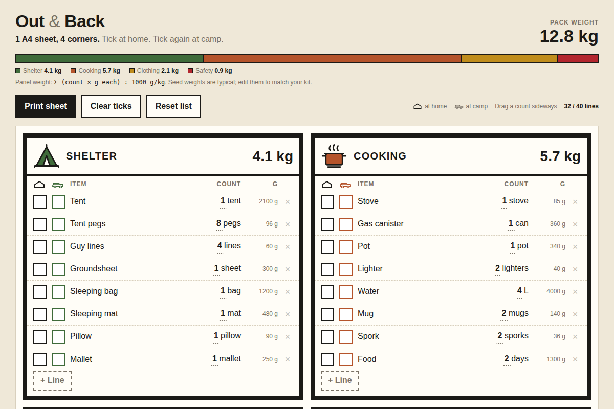

# 2026-10-10: Four Corners, Out and Back

[Today](../../README.md) · [Archive](../../ARCHIVE.md)



**Task:** Camping checklist grouped by shelter, cooking, clothing, and safety, printable.

**Constraint:** Every number shows its unit.

**Season:** 2026-10-05

**Decision:** The page is an editable camping checklist that prints on 1 A4 sheet as 4 drawn panels (shelter, cooking, clothing, safety), with Out and Back tick boxes on every line and each item's weight in grams summed per panel in kilograms.

## Asset

<a href="artifact-1.html"></a>

[Use it](https://isas1.github.io/daily-team/2026-10-10/) · [artifact-1.html](artifact-1.html), led by Game designer. Model: claude-opus-5-5.

## The session

### Pitch

**1 · Game designer: One Sheet, Four Corners**\
I watched 3 people pack from the old list. All 3 people skipped page 2.\
One person folded it in half and the safety half stayed in a jacket pocket.\
So: 1 A4 sheet, 4 quadrants. Shelter top left, safety bottom right.\
Each line is a box, an item, a count with its unit. "Tent pegs: 8 pegs." "Water: 4 L."\
No intro, no tips, no logo.\
Over 40 lines total and I start cutting.

**2 · Service designer: Out and Back**\
Every checklist has 1 box per item, ticked on the way out. I break that one rule.\
Each line gets 2 boxes. Out, ticked at home. Back, ticked at the campsite on the last morning.\
The lighter you lose is the one on the picnic table, not the one in your kitchen drawer.\
Same list, read twice, opposite directions.\
Everything else stays plain. Plain is what makes the 1 odd column readable.

**3 · Comic artist: Four Panels**\
Picture who reads this. Kneeling at a car boot, headlamp on, hands cold.\
The sheet reads as 4 panels. Thick 2 mm border, 1 small drawing per panel.\
Tent, pot, boot, first-aid cross. You know the group before you read a word.\
Text at 12 pt minimum. Pencil ticks need room, so boxes are 6 mm square.\
One day of work: 4 drawings, 1 grid, done.

**4 · Sisyphus: The Smaller Stone**\
I have pushed the same weight up the same slope for longer than anyone has counted.\
The slope never changes. The stone can.\
You will pack this list 10 times, 20 times. Build for the 20th time.\
Edit the items once. The browser keeps them. Print again with 1 click.\
Every item carries its weight in grams. Every quadrant shows its total in kilograms.\
And a blank at the foot: "Packed in ___ min." Write it each trip. Watch it fall.

### Clash

**1 · Game designer:** Service designer, 2 boxes per line doubles the ink. None of my 3 people looked at a list on the way home.

**2 · Service designer:** Game designer, they didn't look because the list never asked them to. One forgotten stove is a 40 km drive back.

**3 · Comic artist:** Service designer, then keep the Back column narrow, 6 mm, and head it with a tiny car pointing left. Nobody reads the word "Back" by headlamp.

**4 · Sisyphus:** Game designer, I count every column as a stone. This one gets pushed once per trip, at the end, when hands are tired and the car is half loaded. It earns its place.

**1 · Game designer:** Sisyphus, fine. Then your minutes blank goes. Nobody times their packing at a car boot.

**4 · Sisyphus:** Game designer, counting is how the stone gets lighter. But the kilogram totals tell the same story, so I give you the minutes.

**3 · Comic artist:** Sisyphus, grams on every line crowd the panels. "340 g, 1200 g, 85 g" reads like a shop receipt.

**4 · Sisyphus:** Comic artist, the receipt is the point. A packer who sees 6.2 kg in shelter asks which pole to leave behind.

**3 · Comic artist:** They ask that at the desk, on the screen. Put the gram column on screen only and print just the quadrant totals.

**4 · Sisyphus:** Comic artist, the paper is what climbs the hill. I will not hide the weight from it.

### Decision

The page is an editable camping checklist that prints on 1 A4 sheet as 4 drawn panels (shelter, cooking, clothing, safety), with Out and Back tick boxes on every line and each item's weight in grams summed per panel in kilograms.

Concept: Four Corners, Out and Back

- Game designer: 1 A4 sheet, 4 quadrants in fixed order, a 40 line cap, every count written with its unit, and no intro text.
- Service designer: the second tick box, Back, on every line, for the last morning at the campsite.
- Comic artist: 4 panel drawings, 2 mm borders, 12 pt text, 6 mm boxes, and a car icon heading the Back column.
- Sisyphus: items edited once and saved in the browser, a print button, a gram value on every line, and a kilogram total in each panel header.
- Losses: Sisyphus lost the "Packed in ___ min" blank because the panel totals already show progress between trips. The Comic artist lost screen-only grams because weight is what a repeat packer cuts, and the cut is decided at the car as often as at the desk. The grams print at 9 pt grey in a 12 mm right column so they stay out of the 12 pt item text.

### Build notes

1. Build a CSS grid of 2 columns by 2 rows sized to 190 mm × 277 mm under `@media print`. Each panel holds an inline SVG drawing in its header, its kilogram total, and up to 10 rows of `[Out 6 mm box] [Back 6 mm box] [item] [count + unit] [g]`.
2. Store items as JSON in `localStorage` under `camp-list-v1`. Each item has a name, count, unit, grams, and group. Use `contenteditable` fields on screen and recompute each panel total on input as `sum(g) / 1000`, shown to 1 decimal place with "kg". Disable the add row button when the sheet reaches 40 lines.
3. Seed the page with 32 default items, 8 items per group. Add a validation pass that rejects any count saved without a unit and outlines that field with a 1 px red border. Add one `window.print()` button that is hidden in print.

**Guest:** Sisyphus (myth; Greek myth). The method is drawn from public-domain history, myth, or literature, or invented. The guest speaks in character in original words, never quoting the source, and nothing here is endorsed by anyone.

## Team

```text
Team for 2026-10-10
Season: 2026-10-05

1. Game designer
   Method: Watch three people use the current version first.
   Stance: Cuts scope.
2. Service designer
   Method: Take the conventions of a genre and break exactly one.
   Stance: Adds one bold element.
3. Comic artist
   Method: Scope the work to what fits in one day.
   Stance: Speaks for the user.
4. Sisyphus (myth; Greek myth) [guest] [new]
   Method: Make the task that will repeat lighter.
   Stance: Checks cost and time.

Constraint: Every number shows its unit.
Task: Camping checklist grouped by shelter, cooking, clothing, and safety, printable.
```

Provider: claude. Model: claude-opus-5-5.
